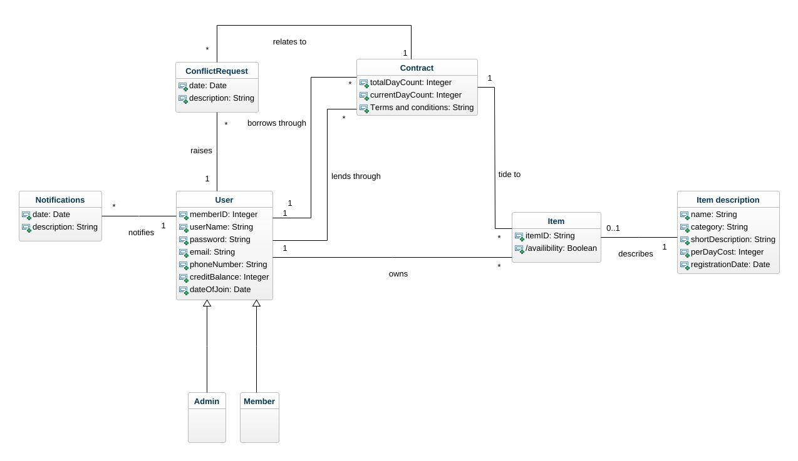

# Assignment 1
- Benoît Dervieux : *bd222ch*
- Chanuka Don Samarasinghage : *cd222pc*

## Garde 2 task - stuff lending system

## Introduction 

The objective of this task is to create a Domain model for the scenario of the stuff lending system. 
A domain model is a structured view of the information that is required to support the requirements of a given system. It relates to the business logic and avoid from using a software development perspective.

## 3 steps for developing the domain model 

Based on the course literature, here are the three steps we used to complete this task.

1. Find the computational classes
2. Draw the UML diagram 
3. Add associations and attributes 

## Identifying the conceptual classes 

The main tool used to identify the classes was a noun phrase analysis. It helped us to locate the most important concepts of the organization:

- Member
- System Administrator 
- Member Validation Service 
- Item
- Credits 
- Lending Contract
- Conflict resolution 
- Notifications

### User class -> selected
Members and System administrators are both Users of the system. Their information is required to effectuate different tasks. We considered them as classes. However, to the extent of the description available there aren't any information that makes them unique from each other for the most case. Then, a generalized class named user was used to hold their information.

### MVS -> not selected
The main objective of the MVS is to validate the uniqueness of a new users information. Here it is assumed the MVS will not hold its own copy of the users information due to redundancy. Thus, there isn't clear need of MVS class in the context of a domain model. This could be refined for further analysis in case the registration process would be described more deeply.

### Item -> selected 
The Item is also a core element of the system and carries important information that supports the business logic. As such this was selected as a class.

### Credits -> not selected
Even though credits is one of the main requirements in the system, this leans on more towards an attribute. This was decided by the rule where if you are able to explain the concept by just words or numbers, it is most likely an attribute. As such this was excluded.

### Lending Contract (Contract) -> selected
This also holds important information that is required to support the business logic and may be the most important in the process. As such this was selected as a class.

### Conflict resolution (ConflictRequest) -> selected
If a conflict arises, certain data need to be tracked such as the date the issue was raised and the description of the issue. Thus, this was selected as a class but was renamed as conflict request .

### Notification -> selected 
When sending notifications, information such as the date and the description needs to be remembered. As such, Notifications was selected as a class.

### Extra class :- ItemDescription 
It was explained in the course material that a description class is used when there is a need to remember the data about the Item even when it's currently not available. We believe that the system should keep information about the items, at least to avoid fraud based on getting credits when adding a new item. 

## Draw the classes 
Based on the analysis above the classes were drawn using UML

## Identifying attributes

Explanations of how the attributes were are gives below on a class by class basis 

### User

1. Member ID - In the use case 2 main scenario 6th point "The system creates a new member profile, assigns a ***unique member ID***, and records the date of creation"

2. User Name - In the use case 1 main scenario 3rd point "The person supplies a ***username and password***"

3. Password - Same as above 

4. Phone Number - In the use case 2 main scenario 3rd point "The person supplies a username, a password, an ***email and a phone number***"

5. email - same as above

6. Credit Balance - Open issues point one. Here it was realized that this is the best place to define a credit balance where each user will have a balance of their own.

7. Date of Join - In the use case 2 main scenario 6th point "The system creates a new member profile, assigns a unique member ID, and records the ***date of creation***"

### Item

1. Item ID - As there could be two items with the same exact description as such for the purpose of having a uniquely identifying those two items this attribute was assumed and added.

2. Availability  - Open issues point 2 "More details are needed about how ***item availability*** is determined and tracked".   

### ItemDescription 

1. Name - In the use case 3 main scenario 1st point " The member provides the item details including ***category, name, and a short description***"

2. Category - same as above

3. Short description - same as above

4. Per Day Cost - An items is supposed to have a cost however, it is not specified how the cost is calculated as such it was assumed that the item will have a per day cost. 

5. Registration date - This is to cross check whether the user has registered this item before and when in order to check whether the user is exploiting the credit reward system as explained before in the creation of an item description class.

### Contract

1. Total day count - A contract will be for a certain amount of days which need to be tracked. This is to support case 5 Advance day count 

2. Current day count - This will count how many days have passed since the contract was established. This also supports the above case.

3. Terms and conditions - In open issues point 2 "Item Availability and ***Loan Terms***". This is to note down the terms of agreement and can be referred incase there is a complaint about breach of contract

### Conflict request
There were not specific directions on what a conflict request should have but for the sake of simplicity the following two attribute were selected as the core requirements.

1. Date - The date the issue is raised

2. Description - The explanation of the issue

### Notification 

1. Date - The date will be use to confirm a specific notification was sent to the user on the correct day (Eg:- When the contract is ended).

2. Description - A description about what the notification is.

## Associations

There were a total of 8 associations identified in the UML diagram. Their multiplicities are explained below

1. Borrows through - The users has the ability to borrow any number of items through contracts but an item can only be borrowed by 1 member at a given time through the contract.

2. Lends through - User can have many lending contracts but a lending contract can only have one user (lender) at a given time

3. Owns - User can own many items but an item can have only one owner at a given time (It is assumed that an Item has one owner at a given time)

4. Tied to - A contract can have several Items at a given time but a Item can only be tied to one contract at a given time (It is assumed that a contract can have many Items)

5. Describes - One Item is described by one description but, as explained we plant to keep the data about the item at least for a certain period to avoid fraud where a member tries to re-register the Item over and over again to get more credits. Thus a description may have a related Item or not.

6. Raises - A user can raise many conflict requests but a conflict request is only raised by one user at a given time

7. Related to - Conflict request will only be related to one contract at a given time but a contract may have several conflict requests raised on it.

8. Notifies - A user will have many notifications sent to them but a notification notifies only one user at a given point

## The domain model 
Based on the above findings the following ***Domain Model*** was developed.

