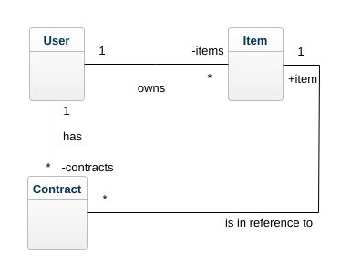
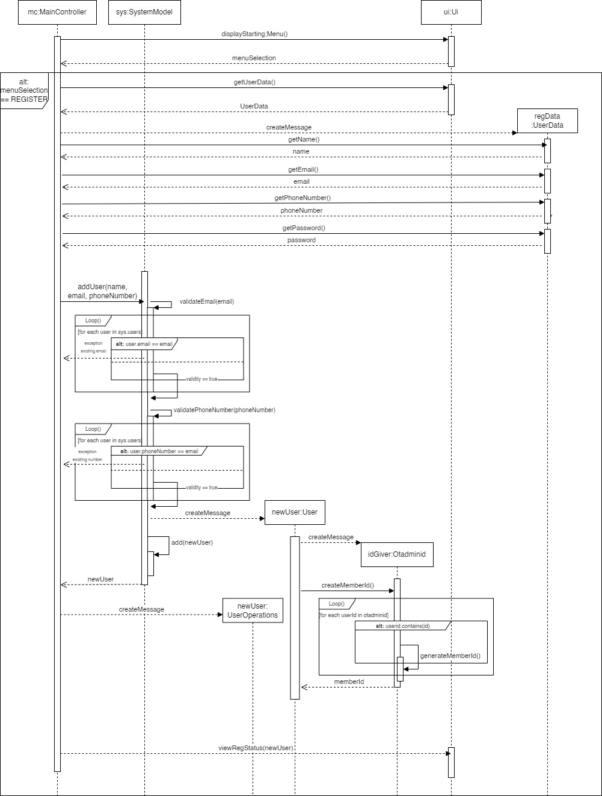
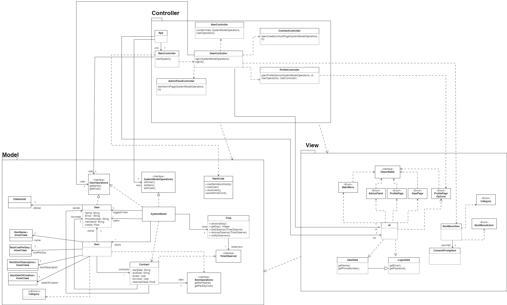
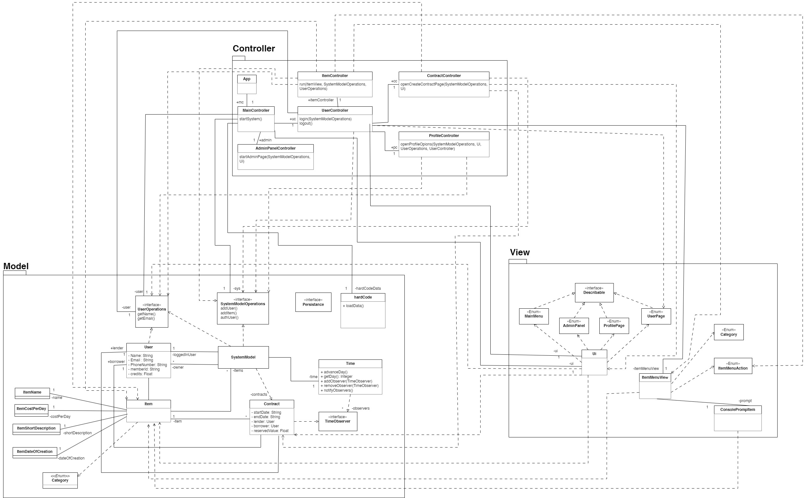
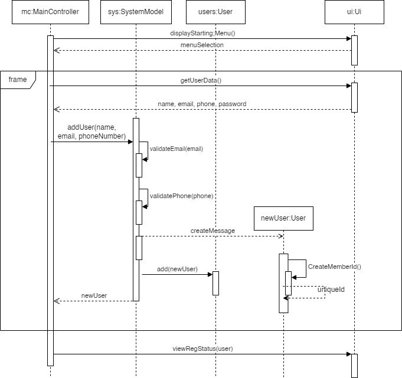

# Stuff lending system OO-Design - A2
This document describes the design according to the requirements presented in assignment 2.

## Running
The application should start by running console command:  
`./gradlew run -q --console=plain`

## Versioning
Adhere to the git versioning instructions according to the assignment.

## System test
The test have been ran and everything is explained in the testreport.md

## Architectural Overview
The application uses the model-view-controller (MVC) architectural pattern. The view is passive and gets called from the controller. The view may only read information from the model, not directly change it.

# Fixes
## Fix one: Hidden dependencies between view and controller

The UI  was instantiated within the main controller. This was the hidden dependency. If we were to add a new view it will be hard to directly identify which place to plug it in as such this was a mistake to have it in the controller. Fix : passed UI as a parameter to the controller.

Next there were several cases where String arrays and general data types were passed to the controller and actions were carried ot based on indexes. Fix: These were identified and new classes were introduced to hold the data such as LoginData, UserData, ContractData and was passed to the controller as a typed variable.

ProfilePageOptions was using int over a enum to make the selection. Fix: Added ProfilePageOptions enum to make the selection.

## Fix Two: the member id could happen to become the same
We understood that the main reason we could have two similar memberId was that we generated them but we weren't comparing them. 
Hence, we decided to create a new class called "OtAdminId". 
This class would have teh responsibility to hold all the memberId from the all the users as well as generating them.
Hence, when a new User would be created, the memberId field would call the OtAdminId class. 
This one would generate memberIds while the memberId would be unique. In other terms, it doule generate Ids up until the ids are unique comparing to the other ids. 
Then it would return this id and be stocked by the User object.

## Fix Three: View responsibility in model
We had over overridden the to string method. This is having data representation logic in the model. The issue would be if you want to change how the data to be represented in the application you would look in the view, and also if you were to change how it looks you would expect to update the view. However by having the representation in the model that convention where view has the responsibility was violated. Fix: moved all data representation logic to the view.

## Fix Four: Associations need attention in the class diagram
There were several errors mainly with visibility and some dependencies were identified as associations by error. Also the notation had some issues as associations didn't show the direction.Then the associations and dependencies in the observer pattern was fixed. In one case the naming was incorrect where owners was named as users. There were few other errors as well. Also the new updates to fix the issues in the code was also added. The updated class diagram is available below and in design.md.

## Fix Five: There are a lot of relations between User, Item, and Contract respectively. Are all of these needed? How could you make the design simpler?

With further analysis it was identified that having separate references to a lender and a borrower within the contract may be redundant. One fix would have been to move the item to the user with the association userItems and then move the contracts to the user (Borrower). Then have a reference in the contract for the Item. Now the owner of the item can be tracked by the item lent and the borrower will have the list of contracts so the his data also will be available removing the need to have two separate associations for lender and borrower (Removes requirement to have two variables to hold the lender and borrower within contract).  This is a bit more cleaner design compared to the existing one. However this decision will require several changes on how completeTransaction() and refund() methods are placed. One solution here maybe to have another observer on contract status and try to resolve it that way.

Before we implemented this version we were looking at tying to implement a facade pattern based solution for a user to work with items and contracts. Where a user will have a interface called inventory and all the actions would be carried out through the inventory class. Unfortunately we were unable to come up with a working solution. But, If we were successful this also would have reduced the interconnections between the three.

## Fix Six:

The internal actions of how the validation methods work was added and refined. 

The fix was related to how the phone numbers and email, during the verification, were handled. Our fix consisted in showing the process of inner loop being made by iterating through all the emails or phonenumber. To do so, we added a loop section for each process as well as an alt section. This would mean that the model would go through all the user to check their email, throw an error if the email was similar or return true if the email was unique. We as well added the new class inserted for the fix number 2 as well as its inner process. In this case, the loop is repeated up until it finds a unique id comparatively with the other loops. The updated class diagram is available below and in design.md.

## Detailed Design
### Fixed Class Diagram

- only the associations and newly added classes relationships are depicted in this, all the other relationships were removed so it is easier to see the changes.

### Old Class Diagram

## Fixed sequence Diagram

### Old Sequence Diagram

 