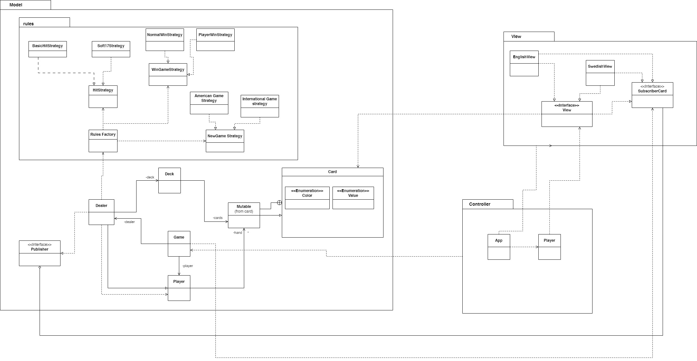
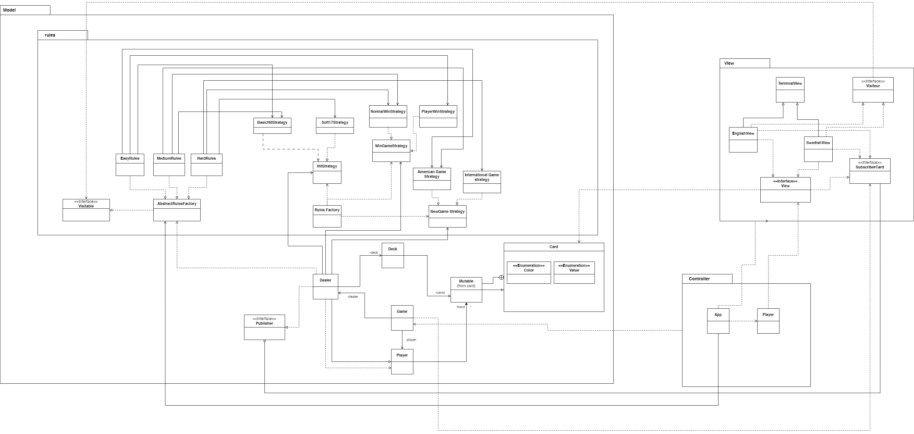
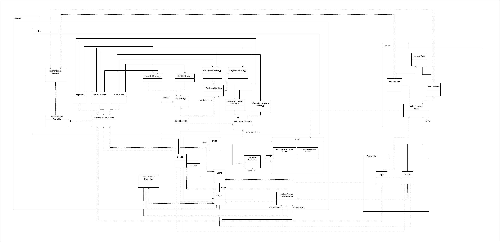

# A3

Assignment 3 of the course of Object Oriented Analysis and Design

Implementation made by Benoit Dervieux.

## Context

The implementations made for this assignments consist in the fullfilement of the requirements of the grade 2.

The original code was provided by the teacher and changes have been made to fullfil those requirements.

## List of changes provided

The list of changes provided are: 

### Implementation of the Stand sequence

I have implemented the stand sequence in the class "Dealer.java" at line 90.

### Removal of the dependency

I have removed the dependency between the controller and the view by letting the reponsability to the view to treat the input. Now, the view collects the event, inform the controller through the following methods: "wantsToQuit()", "wantsToStartNewGame()", "wantsToHit()", "wantsToStand()".

### implementation of the Soft17 rule

I have implemented the soft17 rule that allows the dealer to take a card when it has an Ace and 6 in value. Soft 17 rules is placed in the rules folder.

### Implementation of the win game strategy

The "who wins the game" strategy have been developped. One can find it in the folder rules. The interface is "WinGameStrategy.java" and the implementations are "NormalWinStrategy" and "PlayerWinStrategy".

### Refactoring of a function

The process of getting a card from a deck has been refactored in  a function called processCard that can be found in the class Dealer.

### Implementation of the observer pattern

I implemented the observer pattern using the dealer as the publisher, placing the publisher in the model. I considered the view as the observer and implemented the subscriber in the view.

### Testing

I implemented tests for testing the soft 17 strategy and the win strategies. However, I had to create a new constructor to do so. Hence, I commented out both the constructor and the tests to be able to build the project.

### Limitation and further implementations

One limitation I founnd was the fact of revealing the cards. I tried to implement a new observer pattern that would get notified when the card would get shown but I did not managed to make it work. I feel as if revealing the cards is an important part of the black jack game where all the suspens is.

### Class Diagram

## Assignment 3_3

Here is the section that explains the implementation for the requirements of the assignment 3_3. 

### Abstract factory design pattern

The abstract factory design pattern has been implemented. To do so, I created the abstract class "AbstractRulesFactory" that would contain three methods with each different types of rules to return. 

Then I created 3 different types of "classes of rules" that would return a mix of rules. Thoses classes were: EasyRules, MediumRules and HardRules.

They would extend the AbstractRulesFactory and return three distinct rules according to the difficulty the user wants.

### The visitor pattern

In order to implement the visitor pattern to print out the different types of rules, I first created an interface "Visiteur" which would hold the method "visit" with the 3 different types of strategies to print. This interface is in the View part of the architecture.

Both the "English View" and the "Swedish View" implement it as each implementation is different depending on the language. 

Then I implemented another interface called visitable which receives a "visiteur" typed class.

Then, I charged the abstractRulesFactory to implement it. Iin every type of class of rules, the class would hold as attribute the type of startegies they have and apply that in the method visit.

To instantiate it, I would first instantiate the Abstract factory with the precise implementation i want. Then, the factory would accept the view (by castin it as a "Visiteur") and then I would pass the rules as an argument in the game.

OBS: I did not implement a solution to ask the player which difficulty (s)he would like. However, it would be convenient to think about such a solution.

### Refactoring of the view

As we could have noticed, the English and Swedish view had some method in common (get input, collect events etc.).
Hence, I created a class Terminal View gathering the methods in common and I made in sort that both English and Swedish views would extend it. Terminal View wouldn't not implement the View interface because some methods are dependent on the language choose.

### Class Diagram uploaded for Assignment 3_3

## Fix for A2

You can find the explanation of the fix on the document design.md of this folder. I enclose a revisioned version of the class diagram in this folder as well.

### Fixed classed diagram

